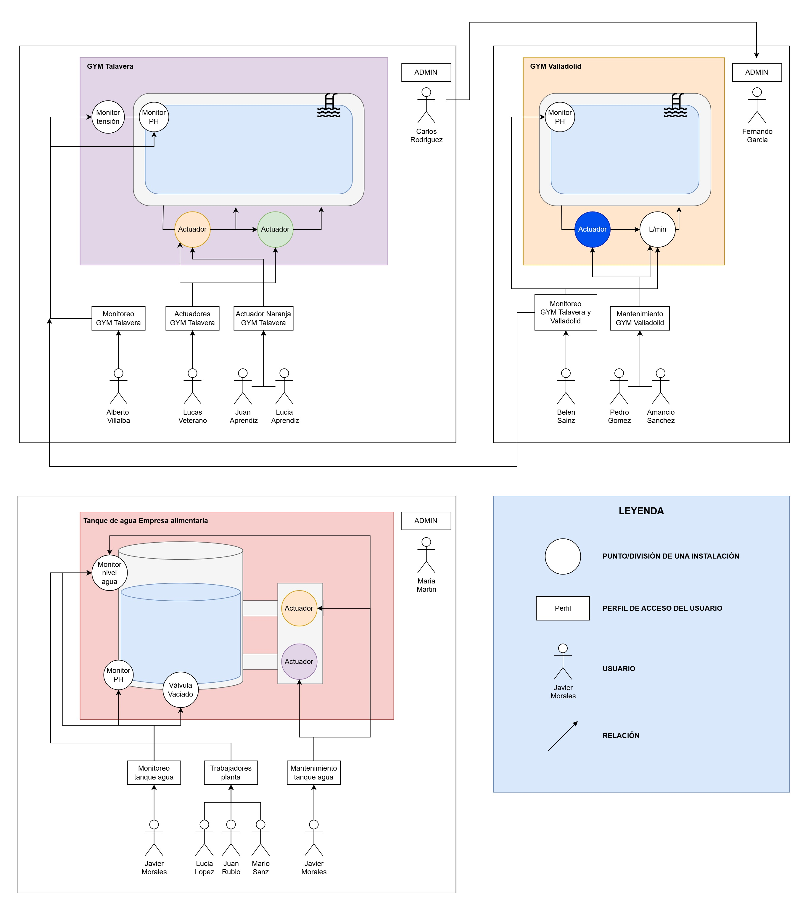
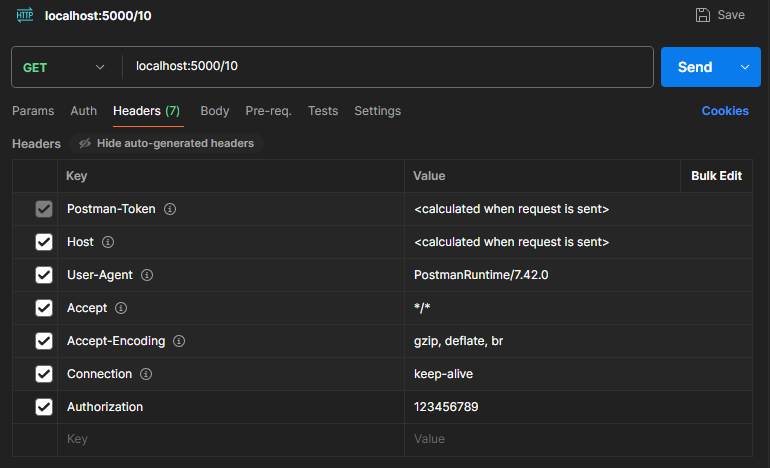
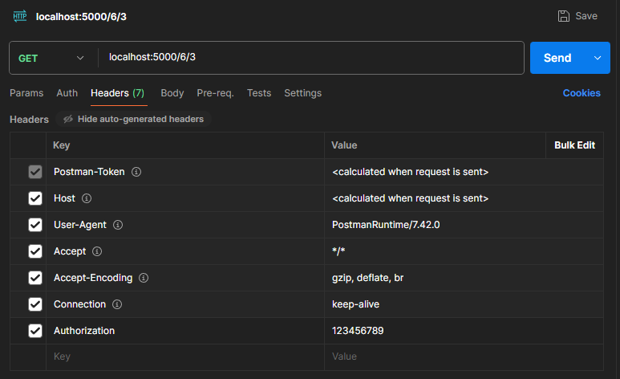
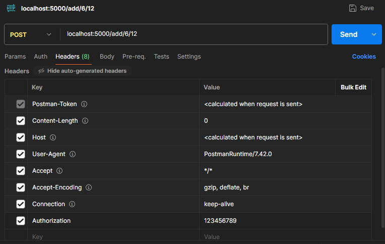
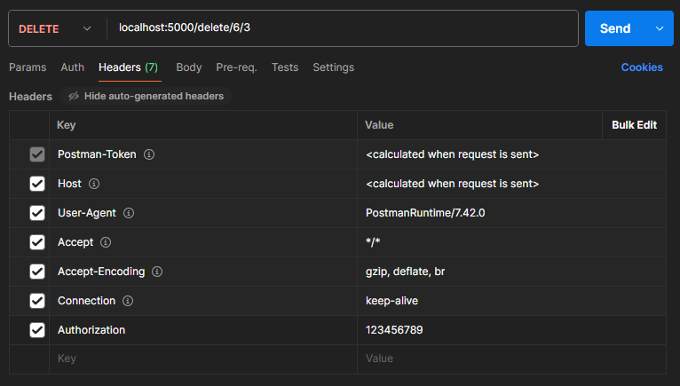
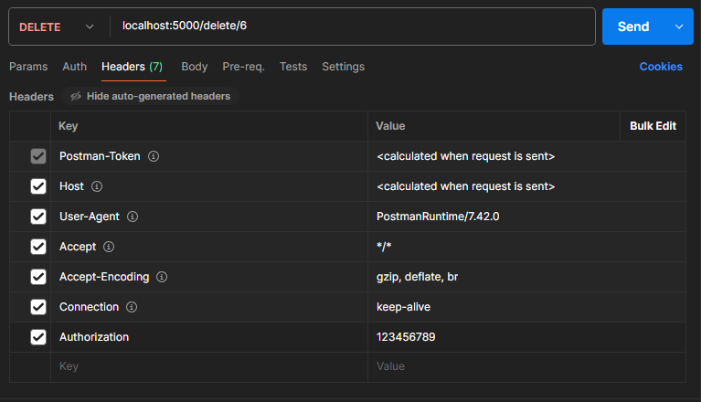
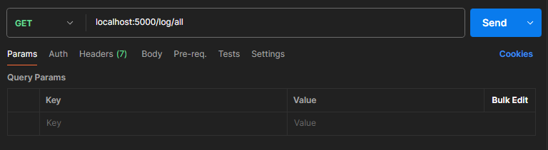

# Reto backend Geodesic
https://github.com/LuisPajareroReina/reto_backend_geodesic.git

Para el desarrollo de esta prueba técnica he utilizado:

- Python
- Flask
- PostgreSQL
- Postman

## Base de datos

### Preguntas

1. ¿Qué tablas o entidades y con qué campos relevantes? ¿Qué relaciones habría entre ellas y por medio de qué campos, que permitan las consultas cruzadas o la modificación o eliminación de datos?

```sql
CREATE TABLE Puntos (
    ID_punto SERIAL PRIMARY KEY,
    nombre_instalacion VARCHAR(100),
    descripcion VARCHAR(100)
);

CREATE TABLE Perfil_acceso (
    ID_perfil_acceso SERIAL PRIMARY KEY,
    descripcion VARCHAR(100)
);


CREATE TABLE Usuarios (
    ID_usuario SERIAL PRIMARY KEY,
    ID_perfil_acceso INT,
    Nombre VARCHAR(50),
    Apellido VARCHAR(50),
    Empresa VARCHAR(50),
    password VARCHAR(50),
    FOREIGN KEY (ID_perfil_acceso) REFERENCES Perfil_acceso(ID_perfil_acceso)
);

CREATE TABLE Acceso_perfil_punto (
    ID_perfil_acceso INT,
    ID_punto INT,
	FOREIGN KEY (ID_perfil_acceso) REFERENCES Perfil_acceso(ID_perfil_acceso),
	FOREIGN KEY (ID_punto) REFERENCES Puntos(ID_punto)
);

CREATE TABLE Registro_acceso (
    ID_registro SERIAL PRIMARY KEY,
    ID_usuario INT,
    ID_punto INT,
    fecha_hora_acceso TIMESTAMP DEFAULT CURRENT_TIMESTAMP,
    FOREIGN KEY (ID_usuario) REFERENCES Usuarios(ID_usuario) ON DELETE CASCADE,
    FOREIGN KEY (ID_punto) REFERENCES Puntos(ID_punto)
);

```
2. ¿Hay alguna tabla donde se podrían incluir alguno datos a pesar de no conocer aún los usuarios y las instalaciones o puntos del sistema?

En mis tablas, basándome en las dependencias se podrían ir creando perfiles de acceso en la tabla Perfil_acceso.

3. ¿Es necesario o conveniente utilizar otros mecanismos en la base de datos como triggers o procedimientos almacenados para algún fin? Y en tal caso, ¿Cuáles serían y qué funcionalidad tendrían?

Se podrían utilizar triggers para ejecutar acciones automáticas cuando, por ejemplo, si se crea un nuevo punto en la instalación se conceda el acceso al administrador


### Visualización de la base de datos

A continuación expongo la visualización de la base de datos que se puede encontrar en el archivo: [init_bbdd.sql](Aplicacion/init_bbdd.sql)

Las características generales son:
- 3 instalaciones con varios usuarios
- Los admin tienen  acceso a todos los puntos de sus instalaciones
- Existen varios tipos de perfil de acceso





## Video

Para mejorar la comprensión de la base de datos utilizada para la validación de las funciones pongo a disposición un vídeo explicativo  

### [Vídeo explicativo](https://youtu.be/ADqcMQ7TFik)


## Arquitectura

### Arquitectura hexagonal
- Dominio
  - modelos.py --> Clases del proyecto (Usuario, etc..)
  - servicios.py --> Casos de uso (Obtener puntos de acceso, obtener ususario...)
- Infraestructura
  - postgresql.oy --> Gestión de la base de datos
- Aplicación
  - entradas.py --> rutas flask, simulación de las entradas del front-end

## Funciones

### Login

- <Rule '/<id_usuario>'>
  - Metodo: GET
  - Objetivo: Acceso a los datos de ususario (simulación de la pantalla de inicio)
  - Nota: password en el header mediante el atributo "Authorization"
  - Robusto frente a ID/contraseñas incorrectas
  
  

### Gestión de acceso a puntos

- <Rule '/<id_usuario>/<id_punto>'>
  - Metodo: GET
  - Objetivo: Acceso a un punto
  - Nota: password en el header mediante el atributo "Authorization"
  - Robusto frente a ID/contraseñas incorrectas
  - Robusto frente a puntos incorrectos

  


- <Rule '/add/<id_usuario>/<id_punto>'>
  - Metodo: POST
  - Objetivo: Añadir el acceso de un punto al perfil de acceso del usuario
  - Evita duplicaciones en la base de datos

  


- <Rule '/delete/<id_usuario>/<id_punto>'>
  - Metodo: DELETE
  - Objetivo: Eliminar el acceso de un punto al perfil de acceso del usuario
  - Evita duplicaciones en la base de datos

  


### Gestión de usuarios

- <Rule '/delete/<id_usuario>'>
  - Metodo: DELETE
  - Objetivo: Eliminar un usuario de la base de datos
  - Evita duplicaciones en la base de datos

  


### Log

- <Rule '/log/all'>
  - Metodo: GET
  - Objetivo: Consultar los accesos a los puntos de la base de datos

  


